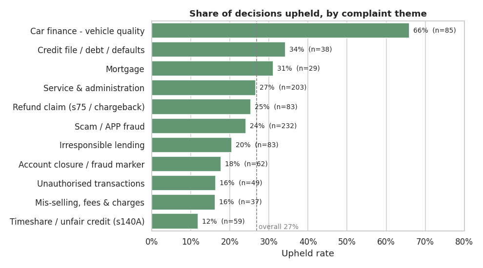
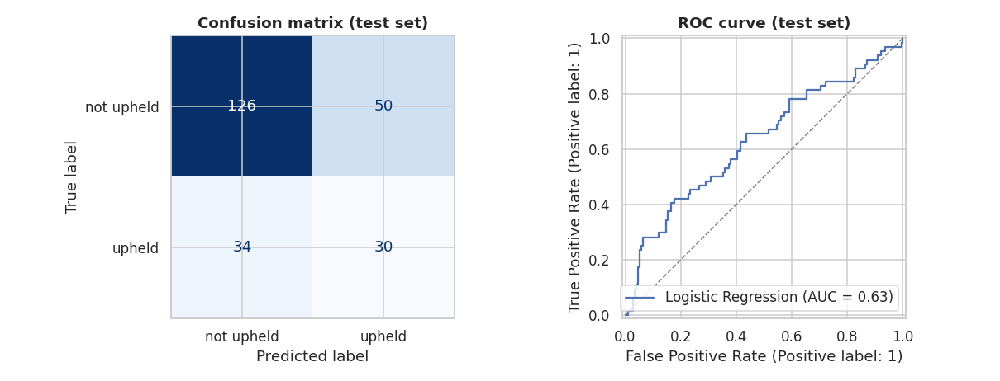

# What do UK bank customers complain about, and which complaints win?

An end-to-end analysis and machine-learning project on **960 real Financial Ombudsman Service (FOS) final decisions**
about UK banks, lenders and payment firms (September 2024 – August 2026).

It answers three questions a bank's customer-insight or complaints team would care about:

1. **What are customers escalating to the ombudsman?** (complaint themes)
2. **Which complaints go the customer's way?** (upheld rates, and a model that predicts them)
3. **What's changing over time?**



---

## Key findings

| # | Finding | Evidence |
|---|---------|----------|
| 1 | **Scams are the biggest single issue.** About 1 in 4 decisions is an authorised push payment (APP) scam, rising to **63% of decisions for digital banks**. | Notebook 02 |
| 2 | **What the complaint is about matters far more than which bank it's against.** Car-finance vehicle-quality complaints are upheld **66%** of the time; timeshare/s140A claims only **12%**. | Notebooks 02, 04 |
| 3 | **Bank-to-bank differences are mostly within the margin of error.** Upheld rates range from 15% (Lloyds Banking Group) to 31% (Santander UK), but most confidence intervals overlap. | Notebook 02 |
| 4 | **Fewer complaints are going the customer's way.** The upheld rate fell from **30% to 24%** between the two years (chi-square p = 0.035), and the fall shows up *within* most themes, not only because the mix changed. | Notebook 05 |
| 5 | **Predicting outcomes from the opening sentence alone is hard.** The best model (logistic regression, categories + text) reaches ROC-AUC **0.63** on unseen data vs 0.50 for a baseline: useful for triage, not a decision tool. | Notebook 04 |
| 6 | **Unsupervised clustering agrees with the rule-based themes** for the distinctive issues (scams, car quality, timeshare, irresponsible lending), which validates the labelling approach. | Notebook 03 |

---

## Project structure

```
uk-bank-complaints-ml/
├── data/
│   ├── raw/fos_banking_decisions.csv     # 960 decisions as collected
│   └── processed/
│       ├── decisions_clean.csv           # cleaned table used by every notebook (and Power BI)
│       └── clusters.csv                  # K-Means cluster for each decision
├── notebooks/
│   ├── 01_data_cleaning.ipynb            # tidy names, firm groups, themes, periods
│   ├── 02_exploratory_analysis.ipynb     # themes, upheld rates, banks, firm types
│   ├── 03_complaint_themes_nlp.ipynb     # TF-IDF + K-Means clustering vs rule-based themes
│   ├── 04_upheld_prediction.ipynb        # classification: will the complaint be upheld?
│   └── 05_trends_over_time.ipynb         # changes in upheld rate and complaint mix
├── src/
│   ├── labels.py                         # firm grouping + keyword theme rules (shared by notebooks)
│   └── collect_fos_data.py               # re-collect or refresh the data via the Apify API
├── reports/figures/                      # every chart, saved as PNG
├── powerbi/POWERBI_GUIDE.md              # how to build the dashboard from decisions_clean.csv
├── docs/LEARNING_GUIDE.md                # file-by-file walkthrough + interview questions
├── requirements.txt
└── README.md
```

---

## Data

**Source:** the Financial Ombudsman Service publishes every final decision as a public record, with complainants anonymised
([decisions database](https://www.financial-ombudsman.org.uk/decisions-case-studies/ombudsman-decisions)). The site has no bulk
download or API, so decisions were collected with the Apify actor
[`spookyweb/uk-fos-decisions`](https://apify.com/spookyweb/uk-fos-decisions), which reads the same public search results.
`src/collect_fos_data.py` reproduces the collection.

**Sample design:** banking, credit and mortgages sector; 12 two-month windows (Sep 2024 – Aug 2026); the **80 most recent
decisions in each window** = 960 decisions. Because every window has the same number of decisions, the analysis compares
**shares and rates over time, never counts**.

| Column | Description |
|---|---|
| `reference` | Unique decision reference (DRN) |
| `decision_date` | Date the final decision was issued |
| `outcome` / `upheld` | "Upheld" / "Not upheld", and the same as 1/0 |
| `business` / `business_clean` | Firm name as published / with spelling variants fixed |
| `firm_group` | Banking group the customer would recognise (e.g. Halifax → Lloyds Banking Group) |
| `firm_type` | High-street bank, Digital bank / e-money, Car & consumer finance, Other lender / payment firm |
| `sector` | FOS product area: Banking and Payments, Consumer Credit, Mortgages |
| `theme` | Rule-based complaint theme (see `src/labels.py`) |
| `complaint_text` | Opening sentence(s) of the published decision summary describing the complaint |
| `period` / `period_start` | Two-month collection window |
| `pdf_url` | Link to the full decision PDF |

---

## Methods

| Step | Technique | Why |
|---|---|---|
| Cleaning | Name normalisation, entity → group mapping | "Monzo Bank Ltd" and "MONZO BANK LIMITED" are the same firm; Halifax decisions are filed under Bank of Scotland |
| Theme labelling | Ordered keyword rules (regex) | Transparent and easy to explain to a business audience |
| Theme validation | TF-IDF + K-Means, silhouette score, Adjusted Rand Index | Checks whether the data's natural groupings agree with the rules |
| Outcome prediction | Logistic regression, random forest, majority-class baseline; stratified 5-fold CV + hold-out test; ROC-AUC and balanced accuracy | Classes are imbalanced (27% upheld), so plain accuracy would mislead |
| Explainability | Logistic regression coefficients | Shows which themes and firms push towards "upheld" |
| Trends | Upheld rate with 95% confidence intervals, chi-square test, within-theme comparison | Separates a real change from a change in complaint mix |



---

## How to run

```bash
git clone https://github.com/Sushma-66/uk-bank-complaints-ml.git
cd uk-bank-complaints-ml
python -m venv .venv && source .venv/bin/activate      # Windows: .venv\Scripts\activate
pip install -r requirements.txt
jupyter notebook notebooks/
```

Run the notebooks in order (01 → 05). Notebook 01 creates `data/processed/decisions_clean.csv`, which the others read.

---

## Limitations

- **Short text.** The model sees only the opening sentence of each decision summary, not the full reasoning. This caps
  both clustering quality and predictive accuracy.
- **Sample, not population.** 80 decisions per window, taken from the most recent days of each window. Good for comparing
  rates; not suitable for volume trends or forecasting.
- **Final decisions only.** Most complaints are resolved earlier by FOS investigators; final decisions are the disputed
  minority, so rates here aren't the same as the FOS's overall published uphold rates.
- **Rule-based themes can mislabel** unusual wording; notebook 01 spot-checks each theme and notebook 03 cross-checks them.

## Next steps

1. Download the full decision PDFs (`pdf_url`) for richer text features, e.g. amount lost, whether a claims firm was involved.
2. Replace TF-IDF with sentence embeddings so scams phrased differently cluster together.
3. Add the FOS half-yearly complaints data (new cases per firm) to build a real volume time series and an ARIMA forecast.
4. Publish the Power BI dashboard (see `powerbi/POWERBI_GUIDE.md`).

---

**Author:** Sushma · [GitHub](https://github.com/Sushma-66) · [Portfolio](https://sushma-66.github.io/SB_Portfolio)

Decision data © Financial Ombudsman Service, published as public record. This project is independent analysis and is
not affiliated with the FOS or any firm named.
